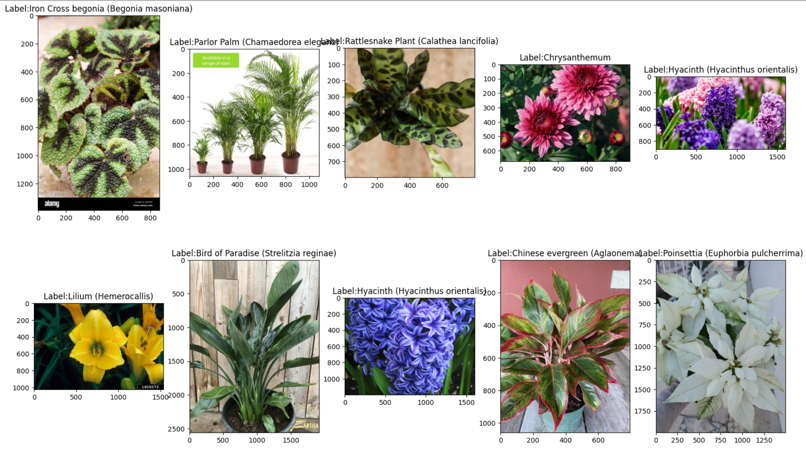
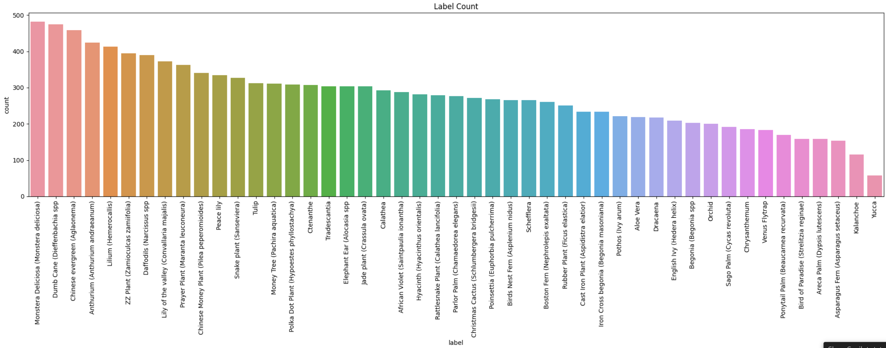
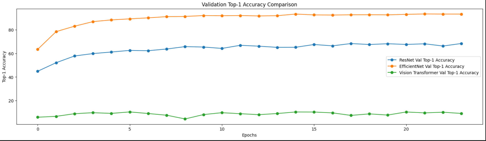
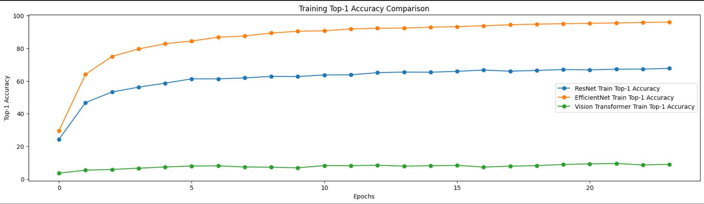
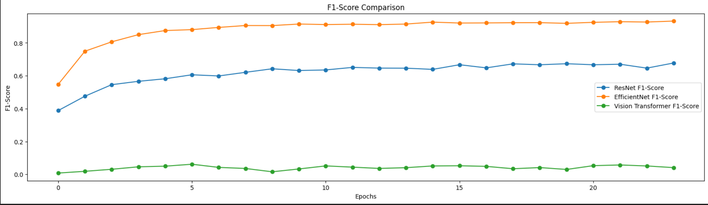
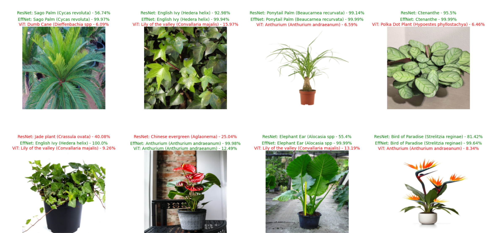

# PlantPixClassifier

PlantPixClassifier, is a image classification project focused to identifying plant species using advanced deep learning models. This repository compares the performance of three  models: ResNet, EfficientNet, and Vision Transformer, to find out which one does better job at classifying the plant images.

## Dataset

The dataset used in this project is the [House Plant Species](https://www.kaggle.com/datasets/kacpergregorowicz/house-plant-species) which images of house plants of 47 different species.

## Models

The models used in this project are: ResNet, EfficientNet, and Vision Transformer. The models are trained using transfer learning with the pretrained weights from the ImageNet dataset.

## Metrics:

Training and validation loss, top-1 and top-5 accuracy, F1-Score, AUC.

## Results

EfficientNet outperformed ResNet and Vision Transformer in accuracy, F1-Score, and AUC, with the highest top-1 validation accuracy of 93.22% and the lowest validation loss of 0.2398.

### Training and Validation Loss

### F1-Score

### Table of Metrics

| Model           | Train Loss | Train Top-1 Acc | Train Top-5 Acc | Val Loss | Val Top-1 Acc | Val Top-5 Acc | F1-Score | AUC    |
 |-----------------|------------|-----------------|-----------------|----------|---------------|---------------|----------|--------|
 | ResNet          | 1.1602     | 67.7211         | 91.1011         | 1.1074   | 68.3435       | 91.0908      | 0.6776  | 0.9810 |
 | EfficientNet    | 0.1306     | 96.0486         | 99.6826         | 0.2398   | 93.2249       | 98.9837      | 0.9326  | 0.9987 |
 | Vision Transformer | 3.5120  | 9.0193         | 30.9435         | 3.5614   | 9.1463        | 28.6077      | 0.0412  | 0.7007 |

## Prediction on Test Images

